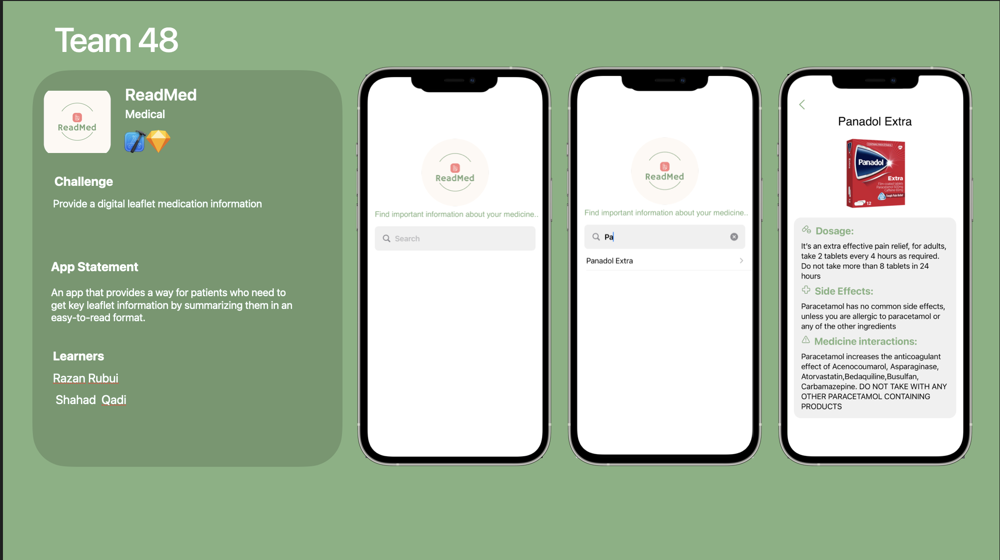

# ReadMedAp
<!-- PROJECT LOGO -->

<h3>   ReadMed  
<a href="https://drive.google.com/file/d/1voRDPYBD59nTCgkxK2VCdDymXtrjr1hE/view?usp=share_link">Demo</a>     </h3>

<h1>Big Idea:</h1>  

 Provide a digital leaflet medication information. 

<h1> challenge Statment:  </h1>

 It is our goal to provide a radable digital leaflet about medicine information.  

<h1> Solution Concept:  </h1>

 a digital summery of medicine leaflet for patients so that they can get the best reslut of the medicine. 

<h2>Challenge Summery: </h2>

<h3>

<h2> User stories: </h2>

 1-The user wants to find a medicin. 
 2-The user wants to view medicine information. 
 3-The user wants to view summrizied information about Dosage, Side Effects, and Medicine Interaction. 
<h2>Success Criteria:</h2>

<1-Project is completed on time.
2-Project meet the functionals requirements.
3-Project team satisfaction target is achieved.
4-Project support both VoiceOver and large and size text accessibilities.

Tools:

[![SwiftUI][SwiftUI-img]][SwiftUI-url] [![Sketch][Sketch-img]][Sketch-url]

Team:

Team 48

<a href="https://www.linkedin.com/in/shahahd-qadi/">Shahad Qadi</a> - <a href="https://www.linkedin.com/in/razan-rubui-4a6228152/
">Razan Rubui</a>
<!-- MARKDOWN LINKS & IMAGES -->
<!-- https://www.markdownguide.org/basic-syntax/#reference-style-links -->
[SwiftUI-img]: https://img.shields.io/badge/-SwiftUI-blue
[SwiftUI-url]: https://developer.apple.com/xcode/swiftui/
[Sketch-img]: https://img.shields.io/badge/-Sketch-yellow
[Sketch-url]: https://www.sketch.com

